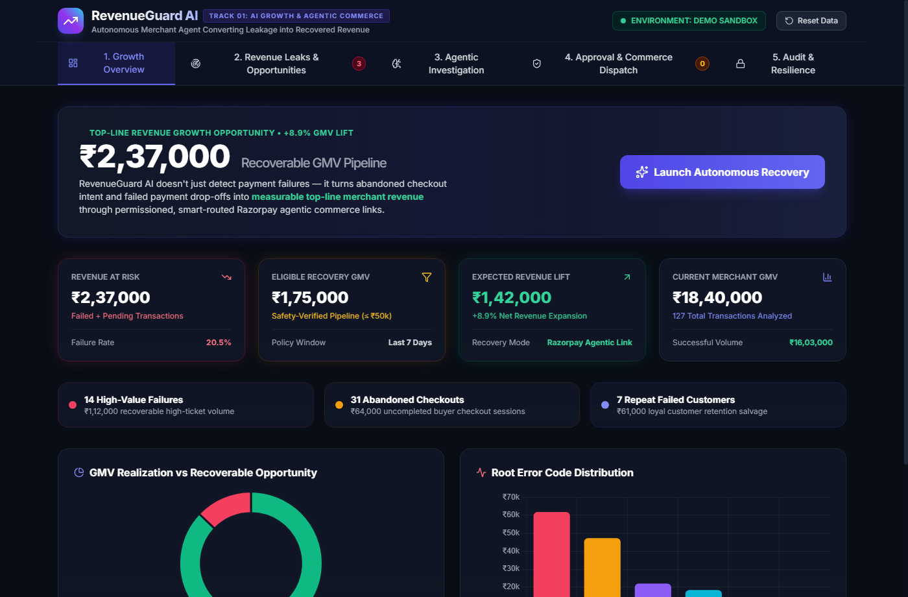
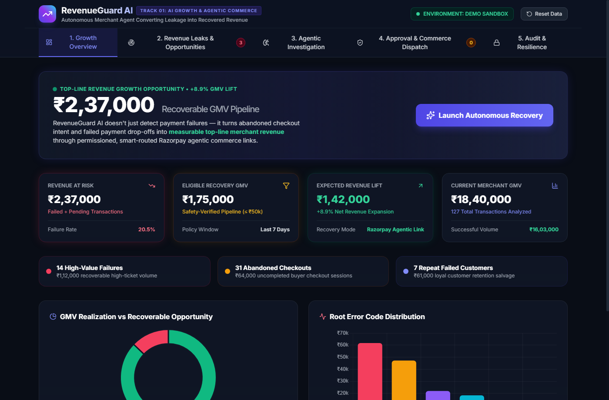
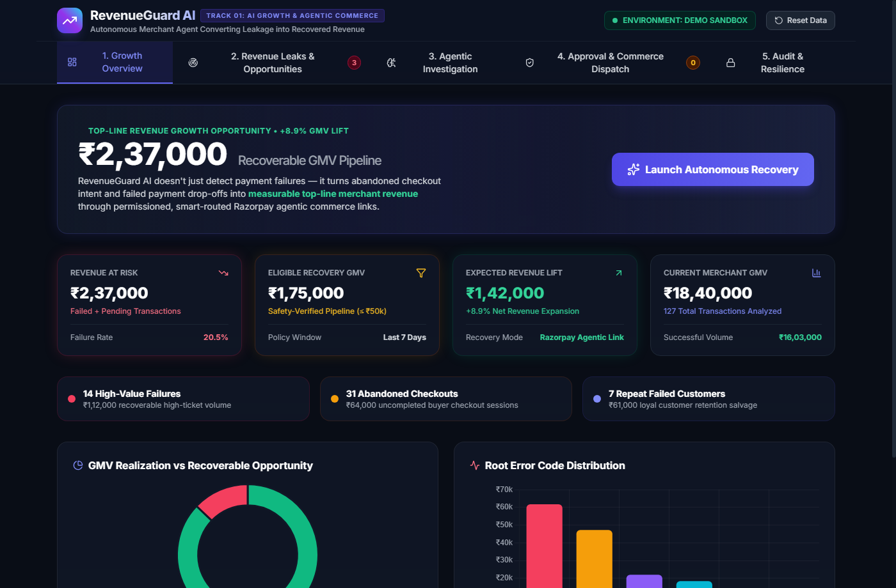
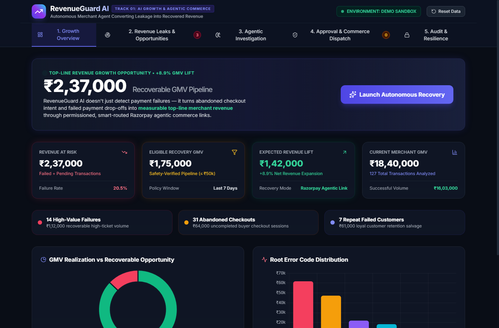

# RevenueGuard AI 🛡️
### Track 01: AI Growth & Agentic Commerce — Razorpay Hackathon

> **Live Deployment**: **[https://revenue-guard-rho.vercel.app](https://revenue-guard-rho.vercel.app)**  
> **System Overview**: An autonomous, permission-gated merchant agent that monitors transaction streams, detects payment and checkout leakage using deterministic metrics, diagnoses root causes through grounded telemetry reasoning, and executes approved recovery actions via **Razorpay Test Mode APIs** under cryptographic auditability and deterministic safety constraints.

---

## 🌟 The Core Problem & Track 01 Solution

In modern e-commerce, merchants lose **15% to 20% of GMV** not because customers lack purchase intent, but due to technical drop-offs:
- Gateway timeouts and 3DS verification friction
- Abandoned checkout sessions where payment links were never authorized
- Repeat payment declines on loyal, high-lifetime-value (LTV) accounts

**RevenueGuard AI** converts this latent intent into **measurable recovered GMV (+8.9% top-line expansion)** by providing an autonomous recovery agent that safely re-engages customers with multi-rail Razorpay payment flows.

---

## 🖥️ Visual Dashboard Walkthrough (Live UI Screenshots)

### 1. Growth Overview Dashboard
> *Real-time visibility into the ₹2,37,000 Recoverable GMV Pipeline, three financial tiers, and root cause error distribution.*


---

### 2. Revenue Leaks & Opportunity Detection
> *Deterministic anomaly grouping across High-Value Failures (₹1,12,000), Abandoned Orders (₹64,000), and Repeat Customer Friction (₹61,000) — summing to exactly 100% of Revenue at Risk.*



---

### 3. Agentic Grounded Telemetry Investigation
> *7-element reasoning breakdown (Evidence, Known Facts, Inference, Unknowns, Confidence, Action, ROI) without hallucinating unobserved root causes.*



---

### 4. Merchant Approval Center & Safety Pre-Flight Checklist
> *Human-in-the-loop authorization gate enforcing the 4-point deterministic safety verification checklist before Razorpay API dispatch.*



---

### 5. Cryptographic Audit Ledger & Security Simulations
> *Tamper-evident SHA-256 hash-chain timeline with live cryptographic chain verification and 3 interactive failure scenarios.*



---

## 📊 100% Reconcilable Deterministic Financial Metrics

All metric calculations are derived directly from the SQLite transaction database with **zero LLM hallucination and 100% mathematical reconciliation**:

| Metric Tier | Amount (INR) | Calculation Definition | Strategic Meaning |
|---|---|---|---|
| **Merchant GMV Analyzed** | **₹18,40,000** | Total attempted transaction volume (127 transactions) | Total cohort baseline |
| **Successful GMV** | **₹16,03,000** | Completed captured volume (70 transactions) | Captured baseline |
| **Revenue at Risk** | **₹2,37,000** | Failed orders (₹1,73,000) + Pending checkouts (₹64,000) | Total detected leakage pipeline |
| **Eligible for Recovery** | **₹1,75,000** | Orders meeting safety policy ($\le$ ₹50k, age $< 7$ days) | Verified actionable recovery pipeline |
| **Expected Revenue Lift** | **₹1,42,000** | Weighted channel recovery probability (81.1%) | **+8.9% Net Top-Line GMV Lift** |

### 🔍 100% Reconciled Leak Breakdown

$$\text{High-Value Failures (₹1,12,000)} + \text{Abandoned Orders (₹64,000)} + \text{Repeat Friction (₹61,000)} = \mathbf{₹2,37,000.0} \quad (100.0\%)$$

1. **High-Value Payment Failures**: 14 high-ticket failed orders totaling **₹1,12,000.0** (Expected Recovery: ₹67,200.0).
2. **Abandoned & Pending Orders**: 31 uncompleted checkouts totaling **₹64,000.0** (Expected Recovery: ₹38,400.0).
3. **Repeat Customer Friction**: 12 failed orders across 7 repeat loyal customers totaling **₹61,000.0** (Expected Recovery: ₹36,400.0).

---

## 🏗️ 5-Layer System Architecture

```
                         ┌────────────────────────────────────────┐
                         │         MERCHANT DASHBOARD (UI)        │
                         │   (Growth, Leaks, AI, Approval, Audit) │
                         └───────────────────┬────────────────────┘
                                             │ REST API / JSON
                                             ↓
                         ┌────────────────────────────────────────┐
                         │         FastAPI APPLICATION CORE       │
                         └───────────────────┬────────────────────┘
                                             │
      ┌──────────────────────────────────────┼──────────────────────────────────────┐
      ↓                                      ↓                                      ↓
┌───────────────────────┐         ┌───────────────────────┐         ┌───────────────────────┐
│ Layer 2: Analytics    │         │ Layer 3: AI Agent 🧠  │         │ Layer 5: Audit Ledger │
│ (Deterministic Math)  │         │ (Grounded Reasoning)  │         │ (SHA-256 Hash Chain)  │
│                       │         │                       │         │                       │
│ • Revenue at Risk     │         │ • Evidence Extraction │         │ • Genesis Block Link  │
│ • Eligible Recovery   │         │ • Known DB Facts      │         │ • Tamper Detection    │
│ • Expected Recovery   │         │ • Root Cause Diagnosis│         │ • Action Audit Trail  │
│ • Leak Categorization │         │ • Controlled Tools    │         │ • State Verifier      │
└───────────┬───────────┘         └───────────┬───────────┘         └───────────▲───────────┘
            │                                 │                                 │
            └────────────────┬────────────────┘                                 │
                             ↓                                                  │
                ┌─────────────────────────┐                                     │
                │ Layer 4: Safety Engine  │ 🛡️                                  │
                │                         │                                     │
                │ 1. Transaction Integrity│                                     │
                │ 2. Amount Match Check   │                                     │
                │ 3. Policy Ceiling Limit │                                     │
                │ 4. Idempotency Lock     │                                     │
                │ 5. Circuit Breaker Liveness                                   │
                └────────────┬────────────┘                                     │
                             │ Verified Safe Proposal                           │
                             ↓                                                  │
                ┌─────────────────────────┐                                     │
                │ Merchant Approval Gate  │ (Human-in-the-Loop)                 │
                └────────────┬────────────┘                                     │
                             │ Signed Approval Token                            │
                             ↓                                                  │
                ┌─────────────────────────┐                                     │
                │ Layer 1: Provider Layer │                                     │
                │  (PaymentProvider ABC)  │                                     │
                │            │            │                                     │
                │ ┌──────────┴──────────┐ │                                     │
                │ │ Demo Sandbox        │ │                                     │
                │ │ Razorpay Test Mode  │ │                                     │
                │ └──────────┬──────────┘ │                                     │
                └────────────┼────────────┘                                     │
                             │                                                  │
                             └──────────── Execution Result ────────────────────┘
```

---

## 🔑 Core Technical Capabilities

### 1. Dual-Provider Polymorphism (Live Razorpay Test Mode + Offline Sandbox)
- **Interface**: Defined via `PaymentProvider` abstract base class.
- **`RazorpayPaymentProvider`**: Connects to live Razorpay Test Mode using the official `razorpay` Python SDK (`client.payment_link.create`, `client.order.create`, `client.payment.fetch`).
- **`MockPaymentProvider`**: Deterministic synthetic sandbox enabling zero-config grading without requiring external API credentials.
- **Visual Status**: Broadcasts `⚡ ENVIRONMENT: RAZORPAY TEST MODE` or `🟢 ENVIRONMENT: DEMO SANDBOX` on the dashboard.

### 2. Grounded AI Reasoning (No Telemetry Hallucinations)
The AI agent (`RevenueGuardAgent`) operates strictly over observed telemetry and deterministic database records:
- **Evidence**: Directly observed error codes (`BAD_REQUEST_ERROR`, `GATEWAY_ERROR`) and retry frequencies.
- **Known Facts**: Verified order values, customer historical LTV, transaction timestamps.
- **Inference**: High-probability operational hypothesis.
- **Unknowns**: Information not present in gateway logs (e.g. issuer internal decline codes).
- **Confidence**: Grounded confidence rating with explicit justification.

```
Evidence ──► Known Facts ──► Operational Inference ──► Unknowns ──► Confidence ──► Action & ROI
```

### 3. Least-Privilege Controlled Agent Tools
The AI agent **cannot execute financial transactions directly**. It only has inspection tools (`analyze_metrics`, `inspect_transaction`, `inspect_customer_history`) and a `request_recovery` tool that routes proposals strictly to the Safety Engine.

### 4. Deterministic Safety & Policy Enforcement Engine 🛡️
A hard security perimeter evaluating five deterministic checks before execution:
1. **Record Integrity**: Transaction ID must exist in local database.
2. **Amount Match**: Requested amount must exactly match the verified database order amount.
3. **Ceiling Limit**: Amount must not exceed merchant threshold ($\le$ ₹50,000).
4. **Idempotency Hash Lock**: SHA-256 action hash prevents duplicate execution.
5. **Circuit Breaker**: Halts downstream calls upon consecutive provider timeouts.

### 5. Cryptographic SHA-256 Hash-Chained Audit Ledger 📜
Every agent analysis, safety validation, approval decision, and provider API dispatch produces an immutable block:

```
Block N Hash = SHA-256( Timestamp | EventType | Actor | Action | TxID | Amount | Metadata | Block N-1 Hash )
```

Includes a built-in cryptographic verifier and interactive tamper detection test.

### 6. Failure & Security Simulation Scenarios
- **Scenario A (API Timeout & Circuit Breaker)**: Downstream timeout $\to$ safe retries $\to$ circuit breaker activation $\to$ Guarantee: *"No duplicate financial action was executed."*
- **Scenario B (Duplicate Request Defense)**: Idempotency filter intercepts and blocks duplicate action submissions $\to$ Guarantee: *"Duplicate financial action prevented."*
- **Scenario C (Amount Tampering Attack)**: Intercepts payload modification (e.g. ₹18,500 tampered to ₹25,000) $\to$ Guarantee: *"Security Alert: Amount Mismatch Blocked."*

---

## 🚀 Quick Start & Installation

### 1. Install Dependencies
```powershell
python -m pip install -r requirements.txt
```

### 2. Start the Application
```powershell
python -m uvicorn backend.main:app --reload --port 8000
```
Open **[http://localhost:8000](http://localhost:8000)** in your browser or visit the live instance at **[https://revenue-guard-rho.vercel.app](https://revenue-guard-rho.vercel.app)**.

### 3. (Optional) Live Razorpay Test Mode Setup
Set your credentials in a `.env` file:
```env
RAZORPAY_KEY_ID=rzp_test_your_key_id
RAZORPAY_KEY_SECRET=your_test_key_secret
```

---

## 🧪 Automated Test Suite

```powershell
python -m pytest tests/ -v
```

11 unit and integration test suites verify all analytics formulas, safety gates, audit chain hashing, and failure simulations:

```
tests/test_analytics.py::test_deterministic_metrics PASSED               [  9%]
tests/test_analytics.py::test_leak_detection_categories PASSED           [ 18%]
tests/test_audit_chain.py::test_hash_chain_integrity PASSED              [ 27%]
tests/test_audit_chain.py::test_tamper_detection PASSED                  [ 36%]
tests/test_safety.py::test_valid_action_safety PASSED                    [ 45%]
tests/test_safety.py::test_amount_tamper_detection PASSED                [ 54%]
tests/test_safety.py::test_nonexistent_transaction PASSED                [ 63%]
tests/test_safety.py::test_over_limit_enforcement PASSED                 [ 72%]
tests/test_simulations.py::test_scenario_a_timeout PASSED                [ 81%]
tests/test_simulations.py::test_scenario_b_duplicate PASSED              [ 90%]
tests/test_simulations.py::test_scenario_c_tampering PASSED              [100%]
```

---

## ⏱️ 2-Minute Technical Demo Walkthrough

| Timestamp | Phase | Demonstration Actions |
|---|---|---|
| **0:00 – 0:25** | **Growth Problem Statement** | Open Growth Overview tab. Highlight **₹2,37,000 Revenue At Risk** across 127 transactions. Explain that revenue leaks from gateway timeouts, 3DS friction, and abandoned checkouts. Show the +8.9% recoverable GMV growth opportunity. |
| **0:25 – 0:50** | **Detection & AI Reasoning** | Navigate to **Revenue Leaks & Opportunities** tab. Click **"Investigate with AI"** on *High-Value Failed Transactions*. Show the grounded 4-box analysis (**Evidence**, **Known Facts**, **Inference**, **Unknowns**, **Confidence**). Click **"Submit for Merchant Approval"**. |
| **0:50 – 1:15** | **Safety Engine & Human Gate** | Navigate to **Approval & Commerce Dispatch**. Walk through the live **4-Point Safety Checklist** (Integrity, Amount Match, Idempotency Key, Ceiling Limit $\le$ ₹50,000). Click **"Approve & Execute via Razorpay"**. |
| **1:15 – 1:35** | **Cryptographic Audit Ledger** | Navigate to **Audit & Resilience**. Show the newly created execution event block. Click **"Verify Audit Chain"** to demonstrate $100\%$ intact SHA-256 chain verification. Click **"Simulate Tamper Attack"** $\to$ **"Verify Audit Chain"** to show instant detection of retroactive record modification. |
| **1:35 – 2:00** | **Security & Resilience Simulations** | Under *Interactive Security & Failure Simulations*, run **Scenario A** (API Timeout) to show circuit breaker activation with the guarantee: *"No duplicate financial action was executed."* Then run **Scenario C** (Amount Tampering) to show the Safety Engine blocking a manipulated payload. |

---

## 📁 Repository Structure

```
revenueguard-ai/
├── api/
│   └── index.py                 # Vercel serverless entrypoint
├── backend/
│   ├── main.py                  # FastAPI server & route orchestration
│   ├── config.py                # Configuration & dual-mode environment settings
│   ├── database.py              # SQLite connection & schema initialization
│   ├── models/
│   │   └── schema.py            # Pydantic models for transactions, leaks, approvals, audits
│   ├── razorpay/
│   │   ├── provider.py          # PaymentProvider ABC, Mock & Razorpay Test SDK adapters
│   │   └── mock_data.py         # Realistic 127-transaction deterministic merchant dataset
│   ├── analytics/
│   │   ├── metrics.py           # Deterministic financial tier arithmetic (₹2.37L, ₹1.75L, ₹1.42L)
│   │   └── leak_detector.py     # Deterministic leak categorization & cohort extraction
│   ├── agents/
│   │   ├── tools.py             # Least-privilege inspection tools (No direct execution tool)
│   │   └── revenue_agent.py     # Grounded AI reasoning engine (Evidence -> Action)
│   ├── safety/
│   │   └── policy_engine.py     # Deterministic safety perimeter & circuit breaker
│   └── audit/
│       └── logger.py            # SHA-256 cryptographic hash-chained audit ledger
├── frontend/
│   ├── index.html               # 5-view responsive glassmorphism merchant dashboard
│   ├── app.js                   # Client state, charts, approval workflows, simulation triggers
│   └── styles.css               # Dark theme glassmorphism UI styling
├── tests/
│   ├── test_analytics.py        # Unit tests for financial formulas & leak detection
│   ├── test_safety.py           # Unit tests for safety rules, limits, and tampering
│   ├── test_audit_chain.py      # Unit tests for SHA-256 hash chain & integrity verification
│   └── test_simulations.py      # Integration tests for Timeout, Idempotency, and Tampering
├── docs/
│   ├── architecture.md          # In-depth architectural specification & sequence diagrams
│   └── screenshots/             # High-resolution UI screenshots of all 5 views
├── DEVELOPMENT.md               # Step-by-step engineering log and tooling transparency
├── LICENSE                      # MIT Open Source License
├── vercel.json                  # Vercel serverless deployment config
├── requirements.txt             # Python dependencies
└── README.md                    # Technical documentation & demo guide
```

---

## ⚖️ License
MIT License. Built for Razorpay Hackathon Track 01: AI Growth & Agentic Commerce.
