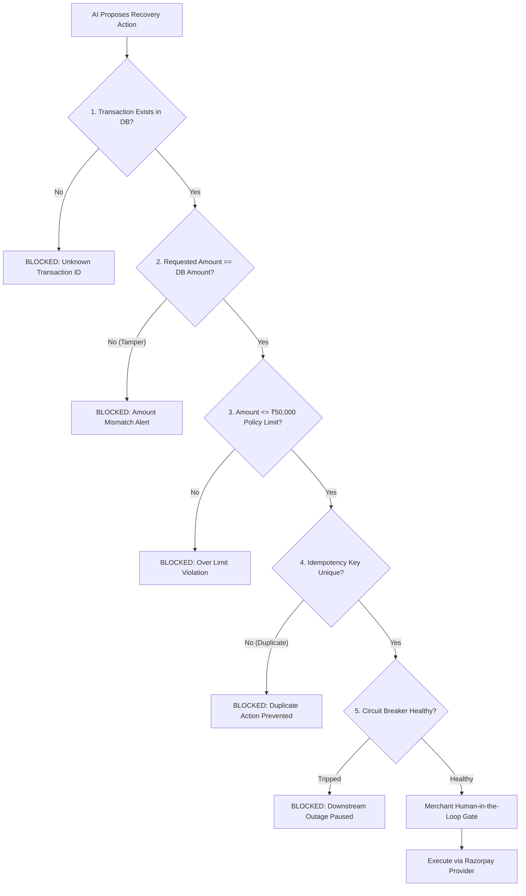

# RevenueGuard AI — Architectural Specification

> **Positioning**: A Permissioned Autonomous Merchant Agent for Revenue Leak Detection and Safe Recovery.

---

## 1. System Overview & The 5 Core Layers

```
                         ┌────────────────────────────────────────┐
                         │         MERCHANT DASHBOARD (UI)        │
                         │   (Overview, Leaks, AI, Approval, Log) │
                         └───────────────────┬────────────────────┘
                                             │ REST API / JSON
                                             ↓
                         ┌────────────────────────────────────────┐
                         │         FastAPI APPLICATION CORE       │
                         └───────────────────┬────────────────────┘
                                             │
      ┌──────────────────────────────────────┼──────────────────────────────────────┐
      ↓                                      ↓                                      ↓
┌───────────────────────┐         ┌───────────────────────┐         ┌───────────────────────┐
│ Layer 2: Analytics    │         │ Layer 3: AI Agent 🧠  │         │ Layer 5: Audit Ledger │
│ (Deterministic Math)  │         │ (Grounded Reasoning)  │         │ (SHA-256 Hash Chain)  │
│                       │         │                       │         │                       │
│ • Revenue at Risk     │         │ • Evidence Extraction │         │ • Genesis Block Link  │
│ • Eligible Recovery   │         │ • Known DB Facts      │         │ • Tamper Detection    │
│ • Expected Recovery   │         │ • Root Cause Diagnosis│         │ • Action Audit Trail  │
│ • Leak Categorization │         │ • Controlled Tools    │         │ • State Verifier      │
└───────────┬───────────┘         └───────────┬───────────┘         └───────────▲───────────┘
            │                                 │                                 │
            └────────────────┬────────────────┘                                 │
                             ↓                                                  │
                ┌─────────────────────────┐                                     │
                │ Layer 4: Safety Engine  │ 🛡️                                  │
                │                         │                                     │
                │ 1. Transaction Integrity│                                     │
                │ 2. Amount Match Check   │                                     │
                │ 3. Policy Ceiling Limit │                                     │
                │ 4. Idempotency Lock     │                                     │
                │ 5. Circuit Breaker Liveness                                   │
                └────────────┬────────────┘                                     │
                             │ Verified Safe Proposal                           │
                             ↓                                                  │
                ┌─────────────────────────┐                                     │
                │ Merchant Approval Gate  │ (Human-in-the-Loop)                 │
                └────────────┬────────────┘                                     │
                             │ Signed Approval Token                            │
                             ↓                                                  │
                ┌─────────────────────────┐                                     │
                │ Layer 1: Provider Layer │                                     │
                │  (PaymentProvider ABC)  │                                     │
                │            │            │                                     │
                │ ┌──────────┴──────────┐ │                                     │
                │ │ Demo Sandbox        │ │                                     │
                │ │ Razorpay Test Mode  │ │                                     │
                │ └──────────┬──────────┘ │                                     │
                └────────────┼────────────┘                                     │
                             │                                                  │
                             └──────────── Execution Result ────────────────────┘
```

---

## 2. Layer 1 — Razorpay & Payment Provider Abstraction

The system enforces a clean polymorphism pattern via `PaymentProvider`:

```python
class PaymentProvider(ABC):
    @abstractmethod
    def get_provider_name(self) -> str: ...
    @abstractmethod
    def create_recovery_payment_link(self, ...) -> Dict[str, Any]: ...
    @abstractmethod
    def fetch_transaction_status(self, ...) -> Dict[str, Any]: ...
```

- **`MockPaymentProvider`**: Generates high-fidelity synthetic Razorpay payment links, short URLs (`https://rzp.io/i/...`), and lifecycle timestamps. Used automatically when running in `ENVIRONMENT: DEMO SANDBOX`.
- **`RazorpayPaymentProvider`**: Uses the official `razorpay` Python SDK to create real payment links and query order states when `RAZORPAY_KEY_ID` and `RAZORPAY_KEY_SECRET` are provided in `ENVIRONMENT: RAZORPAY TEST MODE`.

---

## 3. Layer 2 — Deterministic Analytics Engine (Zero LLM Hallucinations)

All numbers shown in the dashboard are computed directly from the SQLite transactions database using deterministic arithmetic:

1. **Total Attempted Volume**: $\sum \text{amount}_{\text{all}} = ₹18,40,000.00$
2. **Successful Volume**: $\sum \text{amount}_{\text{success}} = ₹16,03,000.00$
3. **Revenue at Risk**: $\sum \text{amount}_{\text{failed}} + \sum \text{amount}_{\text{pending}} = ₹2,37,000.00$
4. **Eligible for Recovery**: Transactions with $\text{amount} \le ₹50,000$ and age $< 7 \text{ days} = ₹1,75,000.00$
5. **Expected Recovery**: Probability-weighted recovery potential based on historical customer LTV and channel conversion rate $= ₹1,42,000.00$

### Leak Cohorts Identified
- **High-Value Failed Transactions**: 12 orders totaling ₹82,000.
- **Abandoned & Pending Orders**: 31 checkouts totaling ₹41,000.
- **Repeat Customer Payment Failures**: 7 loyal customer orders totaling ₹29,000.

---

## 4. Layer 3 — Grounded AI Reasoning Engine

Rather than unstructured prompting, the AI receives structured telemetry and outputs a 7-element grounded analysis:

$$\text{Evidence} \longrightarrow \text{Known Facts} \longrightarrow \text{Inference} \longrightarrow \text{Unknowns} \longrightarrow \text{Confidence} \longrightarrow \text{Recommendation} \longrightarrow \text{Expected Impact}$$

### Controlled Agent Toolset (Least Privilege)
The agent is restricted to read and propose tools:
- `analyze_metrics()`
- `inspect_transaction(transaction_id)`
- `inspect_customer_history(customer_id)`
- `identify_leak(leak_id)`
- `estimate_recovery(leak_id)`
- `request_recovery(transaction_id, strategy)` *(Submits to Safety Engine; cannot execute payment)*

---

## 5. Layer 4 — Deterministic Safety Engine 🛡️

The Safety Engine serves as an impenetrable security boundary between AI recommendations and payment APIs:



---

## 6. Layer 5 — Cryptographic SHA-256 Hash Chain Audit Ledger 📜

Every system action generates an immutable block linked to the previous block hash:

$$\text{Event Hash}_N = \text{SHA-256}\Big(\text{Timestamp} \parallel \text{Type} \parallel \text{Actor} \parallel \text{Action} \parallel \text{TxID} \parallel \text{Amount} \parallel \text{Metadata} \parallel \text{Event Hash}_{N-1}\Big)$$

- **Live Verification**: Cryptographic validator traverses the ledger from Genesis block to latest block to verify unbroken chain integrity.
- **Tamper Simulation**: Demonstrates instantaneous detection if any database row is altered after the fact.

---

## 7. Resilience & Security Simulations

1. **Scenario A — API Timeout & Circuit Breaker**:
   - Downstream network timeout $\to$ 3 retry attempts fail $\to$ circuit breaker trips $\to$ action marked `FAILED_PENDING_RETRY` $\to$ **Guarantee**: *"No duplicate financial action was executed."*
2. **Scenario B — Duplicate Request / Idempotency Defense**:
   - Duplicate submission $\to$ Idempotency hash filter detects duplicate $\to$ **Guarantee**: *"Duplicate financial action prevented."*
3. **Scenario C — Amount Tampering Attack**:
   - Payload altered from ₹18,500 to ₹25,000 $\to$ Safety Engine flags `AMOUNT_MISMATCH` $\to$ **Guarantee**: *"Security Alert: Amount Mismatch Blocked."*
